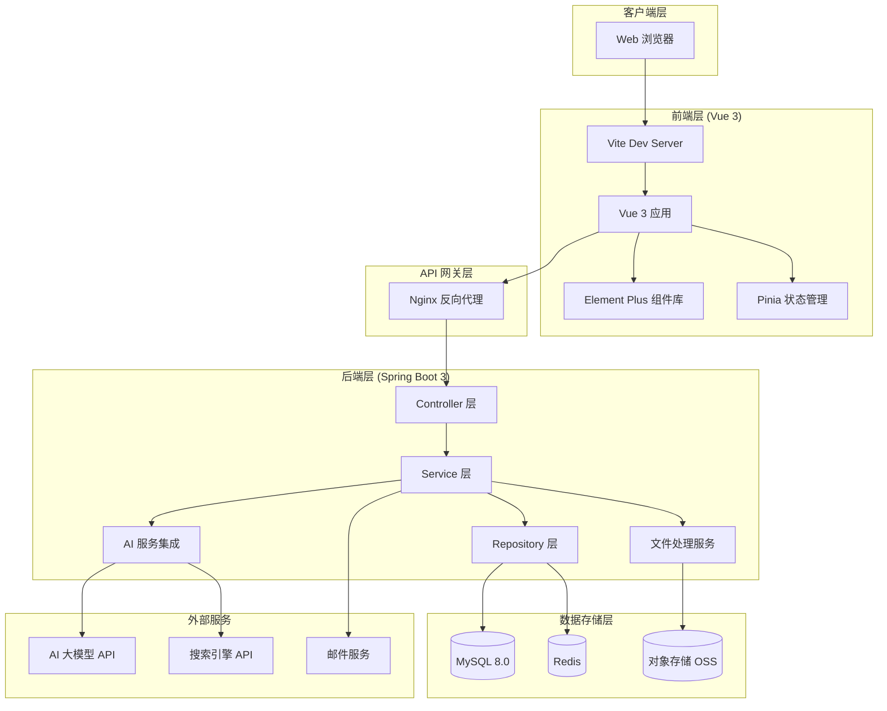

# 系统架构文档

## 架构概述

AI PPT Generator 采用前后端分离的微服务架构，基于 Vue 3 和 Spring Boot 3 构建。

## 整体架构图



## 架构分层说明

### 1. 客户端层

**Web 浏览器**
- 支持现代浏览器：Chrome、Firefox、Safari、Edge
- 响应式设计，支持桌面、平板、移动端

### 2. 前端层 (Vue 3)

**核心技术**
- Vue 3 + TypeScript
- Vite 5 构建工具
- Vue Router 4 路由管理
- Pinia 状态管理

**UI 框架**
- Element Plus UI 组件库
- 自定义 SCSS 主题
- 响应式布局

**主要模块**
- 认证模块 (登录、注册、密码重置)
- PPT 创建模块
- 项目管理模块
- 模板库模块
- 导出模块

### 3. API 网关层

**Nginx 反向代理**
- 静态资源缓存
- API 请求转发
- 负载均衡
- SSL 终结

### 4. 后端层 (Spring Boot 3)

**分层架构**

1. **Controller 层**
   - RESTful API 接口
   - 请求参数验证
   - 统一响应格式

2. **Service 层**
   - 业务逻辑实现
   - 事务管理
   - 服务间调用

3. **Repository 层**
   - 数据持久化
   - 数据库操作
   - 缓存管理

**核心服务**
- AuthService: 认证与授权
- PPTGenerationService: PPT 生成
- TemplateService: 模板管理
- ExportService: 文件导出
- AIService: AI 服务集成

### 5. 数据存储层

**MySQL 8.0**
- 主数据库
- 存储用户、项目、模板等结构化数据
- 使用 InnoDB 引擎
- UTF8MB4 字符集

**Redis**
- 缓存热点数据
- 会话存储
- 分布式锁

**对象存储 (OSS)**
- PPTX 文件存储
- PDF 文件存储
- 图片与模板文件

### 6. 外部服务

**AI 大模型 API**
- PPT 内容生成
- 大纲生成
- 内容优化

**搜索引擎 API**
- 网络内容检索
- 资料聚合

**邮件服务**
- 注册验证邮件
- 密码重置邮件
- 通知邮件

## 技术选型

### 前端技术栈

| 技术 | 版本 | 用途 |
|------|------|------|
| Vue | 3.4+ | 核心框架 |
| TypeScript | 5.4+ | 类型系统 |
| Vite | 5.2+ | 构建工具 |
| Vue Router | 4.3+ | 路由管理 |
| Pinia | 2.1+ | 状态管理 |
| Element Plus | 2.6+ | UI 组件库 |
| Axios | 1.6+ | HTTP 客户端 |
| Vitest | 1.4+ | 单元测试 |
| Cypress | 13.7+ | E2E 测试 |

### 后端技术栈

| 技术 | 版本 | 用途 |
|------|------|------|
| Spring Boot | 3.2.4 | 核心框架 |
| Spring Security | - | 安全认证 |
| Spring Data JPA | - | ORM 框架 |
| MySQL Connector | - | 数据库驱动 |
| Redis | - | 缓存 |
| JWT (io.jsonwebtoken) | 0.11.5 | Token 认证 |
| Apache POI | 5.2.5 | PPTX 生成 |
| iText 7 | 7.2.5 | PDF 生成 |
| Lombok | - | 代码简化 |
| Maven | - | 构建工具 |

## 系统特性

### 安全性

1. **认证与授权**
   - JWT Token 双因子认证 (Access Token + Refresh Token)
   - BCrypt 密码加密
   - 邮箱验证
   - 登录失败限制

2. **数据安全**
   - HTTPS 加密传输
   - SQL 注入防护 (JPA 预编译)
   - XSS 攻击防护
   - CSRF Token 验证

3. **API 安全**
   - 请求频率限制
   - 参数验证
   - 错误信息脱敏

### 性能优化

1. **前端优化**
   - 懒加载路由
   - 组件按需加载
   - 代码分割 (Code Splitting)
   - 静态资源缓存

2. **后端优化**
   - Redis 缓存
   - 数据库索引优化
   - 连接池配置
   - 异步处理

3. **资源优化**
   - 对象存储 CDN 加速
   - 图片压缩
   - 文件分块上传

### 可扩展性

1. **水平扩展**
   - 无状态服务设计
   - 负载均衡支持
   - 分布式会话

2. **服务解耦**
   - 模块化设计
   - 事件驱动架构
   - 消息队列支持

3. **数据库扩展**
   - 读写分离
   - 分库分表准备
   - 数据归档策略

## 部署架构

### 开发环境

```
开发机
├── Docker Compose
│   ├── MySQL (3306)
│   ├── Redis (6379)
│   ├── MailHog (1025, 8025)
├── 后端服务 (8080)
└── 前端服务 (3000)
```

### 生产环境

```
负载均衡器 (Nginx)
├── 前端服务器集群
│   ├── Node.js 服务 1
│   ├── Node.js 服务 2
│   └── Node.js 服务 3
└── API 网关
    ├── 后端服务集群
    │   ├── Spring Boot 1
    │   ├── Spring Boot 2
    │   └── Spring Boot 3
    └── 数据库集群
        ├── MySQL 主库
        ├── MySQL 从库
        └── Redis 集群
```

## 监控与日志

### 监控指标

- **应用监控**: CPU、内存、GC
- **数据库监控**: 连接数、查询性能、慢查询
- **缓存监控**: 命中率、内存使用
- **API 监控**: QPS、响应时间、错误率

### 日志管理

- **应用日志**: 结构化日志 (JSON)
- **访问日志**: Nginx Access Log
- **错误日志**: 统一错误追踪
- **审计日志**: 关键操作记录

## 容灾与备份

### 高可用

- 服务冗余部署
- 自动故障转移
- 健康检查机制

### 数据备份

- 数据库每日全量备份
- Binlog 增量备份
- 对象存储多副本

### 灾难恢复

- 冷备机房
- 数据恢复演练
- 应急预案

---

文档最后更新：2026-04-16
