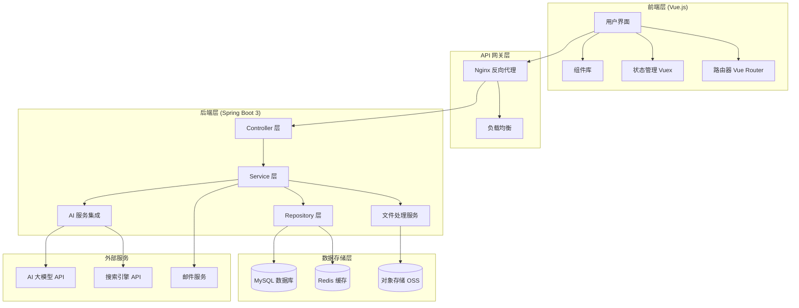

# AI 生成 PPT 应用技术设计

Feature Name: ai-ppt-generator
Updated: 2026-04-16

## Description

AI 生成 PPT 应用是一个基于 Web 的智能演示文稿生成平台，采用前后端分离架构。前端使用 Vue.js 构建响应式用户界面，后端使用 Spring Boot 3 + Maven 提供 RESTful API 服务。系统集成 AI 大语言模型能力，支持多种 PPT 生成方式、丰富模板库和多种输出格式导出。

## Architecture



### 架构说明

1. **前端层**：基于 Vue 3 + TypeScript，使用 Element Plus 组件库，Vuex 进行状态管理
2. **API 网关层**：Nginx 作为反向代理，处理静态资源和 API 请求转发
3. **后端层**：Spring Boot 3 提供 RESTful API，采用分层架构设计
4. **数据存储层**：MySQL 存储结构化数据，Redis 缓存热点数据，对象存储保存文件
5. **外部服务**：集成 AI 大模型、搜索引擎、邮件服务等第三方 API

## Components and Interfaces

### 前端组件

#### 1. 核心组件

- **App.vue**：应用根组件，包含路由视图和全局布局
- **Layout 组件**：
  - `MainLayout.vue`：主布局（包含导航栏、侧边栏、内容区）
  - `AuthLayout.vue`：认证页布局（登录/注册）
- **路由配置**：`router/index.ts` 定义所有路由

#### 2. 页面组件

- **认证模块**：
  - `views/Login.vue`：登录页面
  - `views/Register.vue`：注册页面
  - `views/ForgotPassword.vue`：找回密码

- **PPT 创建模块**：
  - `views/CreatePPT.vue`：创建 PPT 主页面
  - `views/TemplateSelection.vue`：模板选择页面
  - `views/GenerationOptions.vue`：生成选项配置
  - `views/PreviewEditor.vue`：预览和编辑器

- **项目管理模块**：
  - `views/ProjectList.vue`：项目列表页面
  - `views/ProjectEditor.vue`：项目编辑器
  - `views/ProjectDetail.vue`：项目详情

- **导出模块**：
  - `components/ExportDialog.vue`：导出对话框
  - `components/ExportProgress.vue`：导出进度组件

#### 3. 可复用组件

- **PPT 相关**：
  - `PPTPreview.vue`：PPT 预览组件
  - `SlideThumbnail.vue`：幻灯片缩略图
  - `TemplateCard.vue`：模板卡片

- **通用组件**：
  - `LoadingSpinner.vue`：加载动画
  - `ErrorBoundary.vue`：错误边界
  - `ConfirmDialog.vue`：确认对话框

### 后端组件

#### 1. Controller 层

```
com.pptai.controller
├── AuthController.java          # 认证相关接口
├── PPTController.java           # PPT 生成和管理接口
├── TemplateController.java      # 模板管理接口
├── ProjectController.java       # 项目管理接口
├── ExportController.java        # 导出相关接口
└── UserController.java          # 用户管理接口
```

#### 2. Service 层

```
com.pptai.service
├── AuthService.java             # 认证服务
├── PPTGenerationService.java    # PPT 生成服务
├── TemplateService.java         # 模板服务
├── ProjectService.java          # 项目服务
├── ExportService.java           # 导出服务
├── UserService.java             # 用户服务
├── EmailService.java            # 邮件服务
└── AIService.java               # AI 服务集成
```

#### 3. Repository 层

```
com.pptai.repository
├── UserRepository.java          # 用户数据访问
├── PPTProjectRepository.java    # PPT 项目数据访问
├── TemplateRepository.java      # 模板数据访问
└── ExportRecordRepository.java  # 导出记录数据访问
```

#### 4. 实体类

```
com.pptai.entity
├── User.java                    # 用户实体
├── PPTProject.java              # PPT 项目实体
├── Slide.java                   # 幻灯片实体
├── Template.java                # 模板实体
└── ExportRecord.java            # 导出记录实体
```

### 接口定义

#### 认证接口

```java
// POST /api/auth/register
// 用户注册
Request: { email, password, verificationCode }
Response: { userId, message }

// POST /api/auth/login
// 用户登录
Request: { email, password }
Response: { token, refreshToken, user }

// POST /api/auth/logout
// 用户登出
Request: Header: Authorization
Response: { success }

// POST /api/auth/forgot-password
// 忘记密码
Request: { email }
Response: { message }

// POST /api/auth/reset-password
// 重置密码
Request: { token, newPassword }
Response: { success }
```

#### PPT 生成接口

```java
// POST /api/ppt/generate
// 生成 PPT
Request: { 
  mode: "topic" | "web" | "outline",
  topic: string,
  templateId: number,
  options: { slideCount, includeReferences }
}
Response: { projectId, status, estimatedTime }

// GET /api/ppt/generation/{projectId}/status
// 获取生成进度
Response: { 
  status: "pending" | "processing" | "completed" | "failed",
  progress: number,
  message: string
}

// GET /api/ppt/{projectId}
// 获取 PPT 详情
Response: { 
  id, title, slides[], 
  template, createdAt, updatedAt 
}

// PUT /api/ppt/{projectId}
// 更新 PPT 内容
Request: { slides[], title }
Response: { success }
```

#### 模板接口

```java
// GET /api/templates
// 获取模板列表
Query: { category, keyword, page, size }
Response: { templates[], total, page, size }

// GET /api/templates/{id}
// 获取模板详情
Response: { id, name, previewUrl, slides[], category }

// POST /api/templates/{id}/favorite
// 收藏模板
Response: { success }
```

#### 导出接口

```java
// POST /api/export/{projectId}
// 导出 PPT
Request: { format: "pptx" | "pdf" | "link" | "image" }
Response: { exportId, status, downloadUrl }

// GET /api/export/{exportId}/status
// 获取导出状态
Response: { status, progress, downloadUrl }

// POST /api/export/{projectId}/share-link
// 生成分享链接
Request: { password?, expirationDays }
Response: { shareUrl, expirationTime }
```

#### 项目接口

```java
// GET /api/projects
// 获取用户项目列表
Query: { page, size, keyword }
Response: { projects[], total }

// POST /api/projects
// 创建项目
Request: { title, content }
Response: { projectId }

// PUT /api/projects/{id}
// 更新项目
Request: { title?, content? }
Response: { success }

// DELETE /api/projects/{id}
// 删除项目
Response: { success }

// POST /api/projects/{id}/duplicate
// 复制项目
Response: { newProjectId }
```

## Data Models

### 用户表 (users)

```sql
CREATE TABLE users (
    id BIGINT PRIMARY KEY AUTO_INCREMENT,
    email VARCHAR(255) UNIQUE NOT NULL,
    password_hash VARCHAR(255) NOT NULL,
    nickname VARCHAR(100),
    avatar_url VARCHAR(500),
    email_verified BOOLEAN DEFAULT FALSE,
    verification_token VARCHAR(255),
    reset_password_token VARCHAR(255),
    reset_password_expires DATETIME,
    created_at DATETIME DEFAULT CURRENT_TIMESTAMP,
    updated_at DATETIME DEFAULT CURRENT_TIMESTAMP ON UPDATE CURRENT_TIMESTAMP,
    INDEX idx_email (email)
);
```

### PPT 项目表 (ppt_projects)

```sql
CREATE TABLE ppt_projects (
    id BIGINT PRIMARY KEY AUTO_INCREMENT,
    user_id BIGINT NOT NULL,
    title VARCHAR(500) NOT NULL,
    template_id BIGINT,
    generation_mode VARCHAR(50),
    status VARCHAR(50) DEFAULT 'draft',
    generation_progress INT DEFAULT 0,
    generation_message VARCHAR(500),
    created_at DATETIME DEFAULT CURRENT_TIMESTAMP,
    updated_at DATETIME DEFAULT CURRENT_TIMESTAMP ON UPDATE CURRENT_TIMESTAMP,
    FOREIGN KEY (user_id) REFERENCES users(id),
    FOREIGN KEY (template_id) REFERENCES templates(id),
    INDEX idx_user_id (user_id),
    INDEX idx_status (status)
);
```

### 幻灯片表 (slides)

```sql
CREATE TABLE slides (
    id BIGINT PRIMARY KEY AUTO_INCREMENT,
    project_id BIGINT NOT NULL,
    slide_number INT NOT NULL,
    layout_type VARCHAR(50),
    title VARCHAR(500),
    content JSON,
    background_color VARCHAR(50),
    created_at DATETIME DEFAULT CURRENT_TIMESTAMP,
    updated_at DATETIME DEFAULT CURRENT_TIMESTAMP ON UPDATE CURRENT_TIMESTAMP,
    FOREIGN KEY (project_id) REFERENCES ppt_projects(id) ON DELETE CASCADE,
    INDEX idx_project_id (project_id),
    INDEX idx_slide_number (slide_number)
);
```

### 模板表 (templates)

```sql
CREATE TABLE templates (
    id BIGINT PRIMARY KEY AUTO_INCREMENT,
    name VARCHAR(200) NOT NULL,
    category VARCHAR(100),
    description TEXT,
    preview_url VARCHAR(500),
    template_file_url VARCHAR(500),
    color_scheme JSON,
    font_scheme JSON,
    slide_layouts JSON,
    is_premium BOOLEAN DEFAULT FALSE,
    download_count INT DEFAULT 0,
    favorite_count INT DEFAULT 0,
    created_at DATETIME DEFAULT CURRENT_TIMESTAMP,
    updated_at DATETIME DEFAULT CURRENT_TIMESTAMP ON UPDATE CURRENT_TIMESTAMP,
    INDEX idx_category (category),
    INDEX idx_premium (is_premium)
);
```

### 导出记录表 (export_records)

```sql
CREATE TABLE export_records (
    id BIGINT PRIMARY KEY AUTO_INCREMENT,
    user_id BIGINT NOT NULL,
    project_id BIGINT NOT NULL,
    export_format VARCHAR(50) NOT NULL,
    file_url VARCHAR(500),
    file_size BIGINT,
    status VARCHAR(50) DEFAULT 'pending',
    progress INT DEFAULT 0,
    error_message VARCHAR(500),
    share_url VARCHAR(500),
    share_password_hash VARCHAR(255),
    share_expires_at DATETIME,
    download_count INT DEFAULT 0,
    created_at DATETIME DEFAULT CURRENT_TIMESTAMP,
    updated_at DATETIME DEFAULT CURRENT_TIMESTAMP ON UPDATE CURRENT_TIMESTAMP,
    FOREIGN KEY (user_id) REFERENCES users(id),
    FOREIGN KEY (project_id) REFERENCES ppt_projects(id),
    INDEX idx_user_id (user_id),
    INDEX idx_project_id (project_id),
    INDEX idx_share_url (share_url)
);
```

### 用户收藏表 (user_favorites)

```sql
CREATE TABLE user_favorites (
    id BIGINT PRIMARY KEY AUTO_INCREMENT,
    user_id BIGINT NOT NULL,
    template_id BIGINT NOT NULL,
    created_at DATETIME DEFAULT CURRENT_TIMESTAMP,
    FOREIGN KEY (user_id) REFERENCES users(id),
    FOREIGN KEY (template_id) REFERENCES templates(id),
    UNIQUE KEY unique_user_template (user_id, template_id)
);
```

## Correctness Properties

### 数据一致性

1. **用户与项目关系**：每个 PPT 项目必须属于一个有效用户
2. **幻灯片顺序**：同一项目的幻灯片编号必须连续且唯一
3. **导出记录关联**：每条导出记录必须关联有效的用户和项目
4. **模板引用完整性**：项目引用的模板必须存在于模板表中

### 业务约束

1. **生成并发限制**：每个用户同时只能进行最多 3 个 PPT 生成任务
2. **导出频率限制**：每个用户每分钟最多发起 5 次导出请求
3. **分享链接有效期**：分享链接最长有效期为 30 天
4. **自动保存间隔**：项目编辑时自动保存间隔为 30 秒
5. **模板收藏限制**：每个用户最多收藏 100 个模板

### 安全约束

1. **密码复杂度**：密码长度至少 8 位，包含大小写字母和数字
2. **Token 有效期**：JWT token 有效期 24 小时，refresh token 有效期 7 天
3. **验证码有效期**：邮箱验证码有效期 10 分钟
4. **登录失败限制**：连续失败 5 次后锁定账号 30 分钟

## Error Handling

### 错误分类与处理策略

#### 1. 客户端错误 (4xx)

```java
// 400 Bad Request - 请求参数错误
@RestControllerAdvice
public class GlobalExceptionHandler {
    @ExceptionHandler(MethodArgumentNotValidException.class)
    @ResponseStatus(HttpStatus.BAD_REQUEST)
    public ErrorResponse handleValidationException(
        MethodArgumentNotValidException ex) {
        return new ErrorResponse(
            "INVALID_PARAMS",
            "请求参数验证失败",
            extractValidationErrors(ex)
        );
    }
    
    // 401 Unauthorized - 未授权
    @ExceptionHandler(AuthenticationException.class)
    @ResponseStatus(HttpStatus.UNAUTHORIZED)
    public ErrorResponse handleAuthenticationException(
        AuthenticationException ex) {
        return new ErrorResponse(
            "UNAUTHORIZED",
            "用户未登录或登录已过期"
        );
    }
    
    // 403 Forbidden - 禁止访问
    @ExceptionHandler(AccessDeniedException.class)
    @ResponseStatus(HttpStatus.FORBIDDEN)
    public ErrorResponse handleAccessDeniedException(
        AccessDeniedException ex) {
        return new ErrorResponse(
            "FORBIDDEN",
            "无权访问该资源"
        );
    }
    
    // 404 Not Found - 资源不存在
    @ExceptionHandler(ResourceNotFoundException.class)
    @ResponseStatus(HttpStatus.NOT_FOUND)
    public ErrorResponse handleResourceNotFoundException(
        ResourceNotFoundException ex) {
        return new ErrorResponse(
            "NOT_FOUND",
            ex.getMessage()
        );
    }
    
    // 409 Conflict - 资源冲突
    @ExceptionHandler(DuplicateResourceException.class)
    @ResponseStatus(HttpStatus.CONFLICT)
    public ErrorResponse handleDuplicateResourceException(
        DuplicateResourceException ex) {
        return new ErrorResponse(
            "CONFLICT",
            ex.getMessage()
        );
    }
}
```

#### 2. 服务端错误 (5xx)

```java
// 500 Internal Server Error - 内部错误
@RestControllerAdvice
public class GlobalExceptionHandler {
    
    // AI 服务错误
    @ExceptionHandler(AIServiceException.class)
    @ResponseStatus(HttpStatus.INTERNAL_SERVER_ERROR)
    public ErrorResponse handleAIServiceException(
        AIServiceException ex) {
        log.error("AI 服务异常", ex);
        return new ErrorResponse(
            "AI_SERVICE_ERROR",
            "AI 服务暂时不可用，请稍后重试",
            ex.getTraceId()
        );
    }
    
    // 数据库错误
    @ExceptionHandler(DataAccessException.class)
    @ResponseStatus(HttpStatus.INTERNAL_SERVER_ERROR)
    public ErrorResponse handleDataAccessException(
        DataAccessException ex) {
        log.error("数据库异常", ex);
        return new ErrorResponse(
            "DATABASE_ERROR",
            "数据库操作失败，请稍后重试",
            ex.getTraceId()
        );
    }
    
    // 文件系统错误
    @ExceptionHandler(FileSystemException.class)
    @ResponseStatus(HttpStatus.INTERNAL_SERVER_ERROR)
    public ErrorResponse handleFileSystemException(
        FileSystemException ex) {
        log.error("文件系统异常", ex);
        return new ErrorResponse(
            "FILE_SYSTEM_ERROR",
            "文件操作失败，请稍后重试",
            ex.getTraceId()
        );
    }
    
    // 通用异常兜底
    @ExceptionHandler(Exception.class)
    @ResponseStatus(HttpStatus.INTERNAL_SERVER_ERROR)
    public ErrorResponse handleGenericException(
        Exception ex) {
        log.error("未预期异常", ex);
        return new ErrorResponse(
            "INTERNAL_ERROR",
            "系统内部错误，请联系管理员",
            ex.getTraceId()
        );
    }
}
```

#### 3. 外部服务错误处理

```java
@Service
public class AIServiceImpl implements AIService {
    
    @Autowired
    private RestTemplate restTemplate;
    
    @Retryable(
        value = AIServiceException.class,
        maxAttempts = 3,
        backoff = @Backoff(delay = 1000)
    )
    @Override
    public PPTContent generatePPTContent(GenerationRequest request) {
        try {
            return restTemplate.postForObject(
                aiApiUrl + "/generate",
                request,
                PPTContent.class
            );
        } catch (HttpClientErrorException ex) {
            if (ex.getStatusCode() == HttpStatus.TOO_MANY_REQUESTS) {
                throw new RateLimitExceededException("AI 服务请求超限");
            }
            throw new AIServiceException("AI 服务调用失败", ex);
        } catch (HttpServerErrorException ex) {
            throw new AIServiceException("AI 服务内部错误", ex);
        } catch (ResourceAccessException ex) {
            throw new AIServiceException("无法连接 AI 服务", ex);
        }
    }
}
```

### 错误码定义

```java
public enum ErrorCode {
    // 通用错误
    SUCCESS("00000", "操作成功"),
    INTERNAL_ERROR("50000", "系统内部错误"),
    INVALID_PARAMS("40000", "参数验证失败"),
    
    // 认证错误
    UNAUTHORIZED("40100", "用户未授权"),
    TOKEN_EXPIRED("40101", "登录令牌已过期"),
    INVALID_CREDENTIALS("40102", "用户名或密码错误"),
    ACCOUNT_LOCKED("40103", "账号已被锁定"),
    
    // 资源错误
    NOT_FOUND("40400", "资源不存在"),
    DUPLICATE_EMAIL("40900", "邮箱已被注册"),
    
    // AI 服务错误
    AI_SERVICE_ERROR("51000", "AI 服务异常"),
    AI_GENERATION_TIMEOUT("51001", "AI 生成超时"),
    AI_CONTENT_FILTERED("51002", "AI 生成内容被过滤"),
    
    // 导出错误
    EXPORT_FAILED("52000", "导出失败"),
    EXPORT_TIMEOUT("52001", "导出超时"),
    FILE_TOO_LARGE("52002", "文件过大"),
    
    // 限制错误
    RATE_LIMIT_EXCEEDED("42900", "请求频率超限"),
    QUOTA_EXCEEDED("42901", "配额已用完");
    
    private final String code;
    private final String message;
}
```

## Test Strategy

### 测试层次

#### 1. 单元测试

覆盖 Service 层核心业务逻辑：

```java
@SpringBootTest
public class PPTGenerationServiceTest {
    
    @Autowired
    private PPTGenerationService pptGenerationService;
    
    @MockBean
    private AIService aiService;
    
    @Test
    @DisplayName("主题驱动生成 PPT - 成功场景")
    public void testGenerateByTopic_Success() {
        // Given
        GenerationRequest request = new GenerationRequest();
        request.setMode("topic");
        request.setTopic("人工智能应用");
        request.setTemplateId(1L);
        
        PPTContent mockContent = createMockPPTContent();
        when(aiService.generateContent(request)).thenReturn(mockContent);
        
        // When
        Long projectId = pptGenerationService.generate(request, testUser);
        
        // Then
        assertNotNull(projectId);
        verify(pptProjectRepository).save(any(PPTProject.class));
        verify(slideRepository).saveAll(anyList());
    }
    
    @Test
    @DisplayName("网络内容聚合生成 - 搜索失败场景")
    public void testGenerateByWeb_SearchFailed() {
        // Given
        GenerationRequest request = new GenerationRequest();
        request.setMode("web");
        
        when(searchService.search(any()))
            .thenThrow(new SearchServiceException("搜索服务不可用"));
        
        // When & Then
        assertThrows(GenerationException.class, () -> {
            pptGenerationService.generate(request, testUser);
        });
    }
}
```

#### 2. 集成测试

测试 API 接口和数据库交互：

```java
@SpringBootTest
@AutoConfigureMockMvc
public class PPTControllerIntegrationTest {
    
    @Autowired
    private MockMvc mockMvc;
    
    @Autowired
    private ObjectMapper objectMapper;
    
    @WithMockUser
    @Test
    @DisplayName("生成 PPT - 完整流程集成测试")
    public void testGeneratePPT_Integration() throws Exception {
        // Given
        GenerationRequest request = new GenerationRequest();
        request.setMode("topic");
        request.setTopic("气候变化");
        request.setTemplateId(1L);
        
        // When
        MvcResult result = mockMvc.perform(post("/api/ppt/generate")
                .contentType(MediaType.APPLICATION_JSON)
                .content(objectMapper.writeValueAsString(request)))
            .andExpect(status().isCreated())
            .andReturn();
        
        // Then
        String responseBody = result.getResponse().getContentAsString();
        GenerationResponse response = objectMapper.readValue(
            responseBody, GenerationResponse.class);
        
        assertNotNull(response.getProjectId());
        assertEquals("pending", response.getStatus());
    }
}
```

#### 3. 端到端测试

使用 Selenium 或 Cypress 测试完整用户流程：

```javascript
// Cypress E2E Test - 创建 PPT 完整流程
describe('PPT Generation E2E', () => {
  beforeEach(() => {
    cy.login('test@example.com', 'password123');
  });
  
  it('should create PPT from topic successfully', () => {
    // 访问创建页面
    cy.visit('/create');
    
    // 选择主题驱动模式
    cy.get('[data-testid="mode-topic"]').click();
    
    // 输入主题
    cy.get('#topic-input').type('人工智能技术应用');
    
    // 选择模板
    cy.get('.template-card').first().click();
    
    // 点击生成
    cy.get('[data-testid="generate-btn"]').click();
    
    // 等待生成完成
    cy.get('.progress-indicator', { timeout: 60000 })
      .should('not.be.visible');
    
    // 验证结果
    cy.get('.slide-preview').should('have.length.at.least', 8);
    cy.get('.slide-preview').should('have.length.at.most', 15);
    
    // 验证导出功能
    cy.get('[data-testid="export-pptx"]').click();
    cy.verifyDownload('presentation.pptx');
  });
});
```

#### 4. 性能测试

使用 JMeter 或 Gatling 进行负载测试：

```scala
// Gatling 性能测试场景
class PPTGenerationLoadTest extends Simulation {
  
  val httpProtocol = http
    .baseUrl("http://localhost:8080")
    .acceptHeader("application/json")
    .contentTypeHeader("application/json")
  
  // 用户登录
  val login = exec(http("login")
    .post("/api/auth/login")
    .body(StringBody("""{"email":"user@test.com","password":"123456"}"""))
    .check(jsonPath("$.token").saveAs("authToken")))
  
  // 生成 PPT
  val generatePPT = exec(http("generate-ppt")
    .post("/api/ppt/generate")
    .header("Authorization", "${authToken}")
    .body(StringBody("""{"mode":"topic","topic":"测试主题","templateId":1}"""))
    .check(status.is(201)))
  
  // 场景定义
  val scn = scenario("PPT Generation Workflow")
    .exec(login)
    .pause(1)
    .exec(generatePPT)
  
  // 负载配置
  setUp(
    scn.inject(
      rampUsers(100) during (30 seconds),
      constantUsersPerSec(10) during (2 minutes)
    )
  ).protocols(httpProtocol)
}
```

### 测试覆盖率要求

- **行覆盖率**：不低于 80%
- **分支覆盖率**：不低于 75%
- **关键业务逻辑**：100% 覆盖

### 持续集成

```yaml
# .github/workflows/ci.yml
name: CI/CD Pipeline

on:
  push:
    branches: [ main, develop ]
  pull_request:
    branches: [ main ]

jobs:
  test:
    runs-on: ubuntu-latest
    
    services:
      mysql:
        image: mysql:8.0
        env:
          MYSQL_ROOT_PASSWORD: test123
          MYSQL_DATABASE: ppt_test
        ports:
          - 3306:3306
      redis:
        image: redis:alpine
        ports:
          - 6379:6379
    
    steps:
    - uses: actions/checkout@v3
    
    - name: Set up JDK 17
      uses: actions/setup-java@v3
      with:
        java-version: '17'
        distribution: 'temurin'
    
    - name: Run backend tests
      run: mvn clean test
    
    - name: Run frontend tests
      run: |
        cd frontend
        npm install
        npm run test:coverage
    
    - name: Run E2E tests
      run: |
        docker-compose up -d
        sleep 30
        npm run test:e2e
    
    - name: Upload coverage reports
      uses: codecov/codecov-action@v3
      with:
        files: ./target/site/jacoco/jacoco.xml
        flags: backend
```

## References

[^1]: (Vue.js Official Docs) - Vue 3 官方文档 https://vuejs.org/
[^2]: (Spring Boot 3 Reference) - Spring Boot 3 参考文档 https://docs.spring.io/spring-boot/docs/current/reference/html/
[^3]: (Apache POI) - PPTX 文件处理库 https://poi.apache.org/
[^4]: (EARS Requirements) - EARS 需求编写规范 https://www.incose.org/
[^5]: (RESTful API Design) - RESTful API 最佳实践 https://restfulapi.net/
